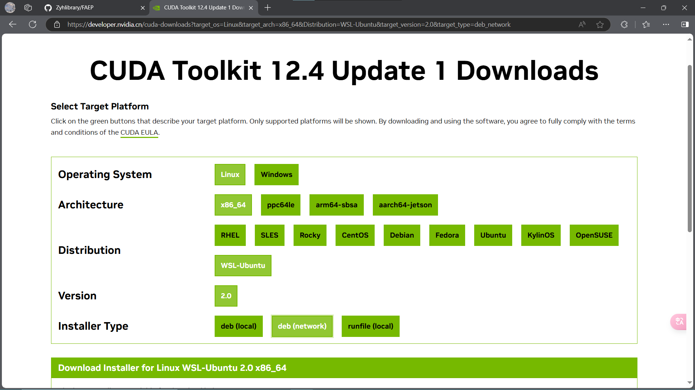
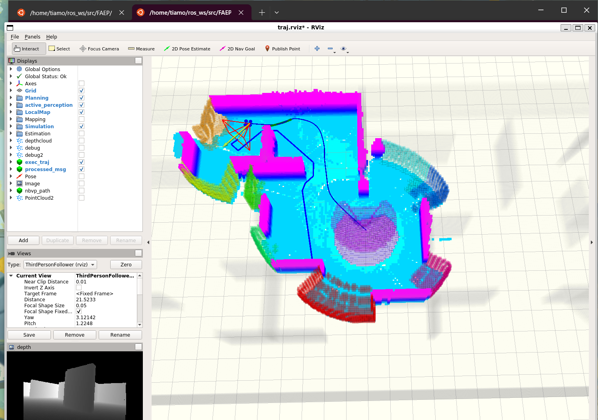

使用WSL2安装Ubuntu-18.04，环境配置，并复现项目

----

[TOC]

# 1. 安装WSL

可以参考官方文档：[适用于 Linux 的 Windows 子系统文档 | Microsoft Learn](https://learn.microsoft.com/zh-cn/windows/wsl/)

如果是第一次安装WSL，我们可以直接在在Powershell中执行命令来完成安装

系统中自带的Powershell是旧版，可以参考[PowerShell 文档 - PowerShell | Microsoft Learn](https://learn.microsoft.com/zh-cn/powershell/?view=powershell-7.4)来安装新版Powershell~~（装不装都行，只是提一嘴）~~

1. 使用管理员身份运行Powershell

2. 执行命令

   ```bash
   # 安装WSL，但不安装Linux发行版
   wsl --install --no-distribution
   ```

# 2. 安装Ubuntu-18.04

注意，在安装Linux发行版前，最好关闭可能修改hosts文件的软件，比如Watt Toolkit的Hosts加速

因为这可能会让你的新系统的hosts文件变成一坨，如果这已经发生了，那么修改hosts文件就好

```bash
sudo nano /etc/hosts
```

1. 重启电脑，再次使用管理员身份运行Powershell

2. 执行命令

   ```bash
   # 安装Ubuntu-18.04
   wsl --install Ubuntu-18.04
   ```

3. 等待一段时间，安装完成后会自己启动WSL，需要新建用户名和密码

   注意：输入密码时为盲人键入，光标会保持在原处，正常键入密码即可

4. 关闭Power shell，可以直接搜索Ubuntu来打开其终端，使用Powershell可能会出现一些问题

   微软官方推荐使用Windows Terminal，Terminal的安装参见：[Windows 终端概述 | Microsoft Learn](https://learn.microsoft.com/zh-cn/windows/terminal/)

如果想要卸载Linux发行版，命令如下：

```bash
# 还是以Ubuntu-18.04为例
wsl --unregister Ubuntu-18.04
```

如果忘记了用户密码可以参照：[技术|在 WSL 上忘记了 Linux 密码？下面是如何轻松重设的方法](https://linux.cn/article-13545-1.html)

如果想要安装其他Linux发行版系统，可以查看可下载的系统

```bash
# 查看可用发行版列表
wsl --list --online

# 返回结果
NAME                            FRIENDLY NAME
Ubuntu                          Ubuntu
Debian                          Debian GNU/Linux
kali-linux                      Kali Linux Rolling
Ubuntu-18.04                    Ubuntu 18.04 LTS
Ubuntu-20.04                    Ubuntu 20.04 LTS
Ubuntu-22.04                    Ubuntu 22.04 LTS
Ubuntu-24.04                    Ubuntu 24.04 LTS
OracleLinux_7_9                 Oracle Linux 7.9
OracleLinux_8_7                 Oracle Linux 8.7
OracleLinux_9_1                 Oracle Linux 9.1
openSUSE-Leap-15.6              openSUSE Leap 15.6
SUSE-Linux-Enterprise-15-SP5    SUSE Linux Enterprise 15 SP5
SUSE-Linux-Enterprise-15-SP6    SUSE Linux Enterprise 15 SP6
openSUSE-Tumbleweed             openSUSE Tumbleweed
```


# 3. 修改软件包源

1. 使用nano打开软件源文件，删除所有原有官方源

   ```bash
   sudo nano /etc/apt/sources.list
   ```

2. 粘贴以下内容，注意，以下内容仅适用于Ubuntu-18.04

   如果需要其他版本系统的软件包镜像源，具体可查看[ubuntu | 镜像站使用帮助 | 清华大学开源软件镜像站 | Tsinghua Open Source Mirror](https://mirrors.tuna.tsinghua.edu.cn/help/ubuntu/)

   ```bash
   # 默认注释了源码镜像以提高 apt update 速度，如有需要可自行取消注释
   deb https://mirrors.tuna.tsinghua.edu.cn/ubuntu/ bionic main restricted universe multiverse
   # deb-src https://mirrors.tuna.tsinghua.edu.cn/ubuntu/ bionic main restricted universe multiverse
   deb https://mirrors.tuna.tsinghua.edu.cn/ubuntu/ bionic-updates main restricted universe multiverse
   # deb-src https://mirrors.tuna.tsinghua.edu.cn/ubuntu/ bionic-updates main restricted universe multiverse
   deb https://mirrors.tuna.tsinghua.edu.cn/ubuntu/ bionic-backports main restricted universe multiverse
   # deb-src https://mirrors.tuna.tsinghua.edu.cn/ubuntu/ bionic-backports main restricted universe multiverse
   
   # 以下安全更新软件源包含了官方源与镜像站配置，如有需要可自行修改注释切换
   deb http://security.ubuntu.com/ubuntu/ bionic-security main restricted universe multiverse
   # deb-src http://security.ubuntu.com/ubuntu/ bionic-security main restricted universe multiverse
   
   # 预发布软件源，不建议启用
   # deb https://mirrors.tuna.tsinghua.edu.cn/ubuntu/ bionic-proposed main restricted universe multiverse
   # # deb-src https://mirrors.tuna.tsinghua.edu.cn/ubuntu/ bionic-proposed main restricted universe multiverse
   ```

   Ctrl+O并回车保存，Ctrl+X退出编辑器

3. 更新软件包目录及软件包，并删除不再需要的依赖

   ```bash
   sudo apt update
   sudo apt upgrade -y
   sudo apt autoremove -y
   ```

4. 更新软件包时会提示订阅Ubuntu Pro，推荐注册一个Ununtu One账号，个人密钥可以免费订阅5台设备

   如果没有订阅Ubuntu Pro，可能得不到部分软件包的更新支持

   注册并获取到个人Token后，在终端输入以下命令：

   ```
   sudo pro attach <你的订阅Token>
   ```

# 4. 安装ROS Melodic

1. 添加安装源及配置密钥

   ```bash
   sudo sh -c '. /etc/lsb-release && echo "deb http://mirrors.ustc.edu.cn/ros/ubuntu/ $DISTRIB_CODENAME main" > /etc/apt/sources.list.d/ros-latest.list'
   sudo apt-key adv --keyserver hkp://keyserver.ubuntu.com:80 --recv-key 421C365BD9FF1F717815A3895523BAEEB01FA116
   sudo apt-key adv --keyserver keyserver.ubuntu.com --recv-keys F42ED6FBAB17C654
   ```

   ROS源的添加也可以参考：[ros | 镜像站使用帮助 | 清华大学开源软件镜像站 | Tsinghua Open Source Mirror](https://mirrors.tuna.tsinghua.edu.cn/help/ros/)

2. 更新软件源并安装ROS

   ```bash
   sudo apt update
   sudo apt-get install ros-melodic-desktop-full
   sudo apt install python-rosdep
   ```

3. 初始化rosdep

   ```bash
   sudo rosdep init
   rosdep update
   ```

4. 配置环境变量

   ```bash
   echo "source /opt/ros/melodic/setup.bash" >> ~/.bashrc
   source ~/.bashrc
   ```

5. 添加工作空间构建所需的依赖

   ```bash
   sudo apt install python-rosinstall python-rosinstall-generator python-wstool build-essential
   ```

6. 创建工作空间

   ````bash
   mkdir -p ros_ws/src
   cd ros_ws
   catkin_make
   ````

# 5. 安装CUDA Toolkit

1. 安装Toolkit

   [CUDA Toolkit 12.4 Update 1 Downloads | NVIDIA 开发者](https://developer.nvidia.cn/cuda-downloads)

   做以下选择，可以得到安装命令，当然，可以选择其他cuda版本的Toolkit

   

   命令如下，一条一条执行即可：

    ```bash
    wget https://developer.download.nvidia.com/compute/cuda/repos/wsl-ubuntu/x86_64/cuda-keyring_1.1-1_all.deb
    sudo dpkg -i cuda-keyring_1.1-1_all.deb
    sudo apt-get update
    sudo apt-get -y install cuda-toolkit-12-4
    ```

2. 配置环境变量并启用

   ```bash
   echo "export CUDA_HOME=/usr/local/cuda" >> ~/.bashrc
   echo "export PATH=\$PATH:\$CUDA_HOME/bin" >> ~/.bashrc
   echo "export LD_LIBRARY_PATH=/usr/local/cuda-12.4/lib64\${LD_LIBRARY_PATH:+:\${LD_LIBRARY_PATH}}" >> ~/.bashrc
   source ~/.bashrc
   ```

3. 安装依赖

   ```bash
   sudo apt-get install freeglut3-dev build-essential libx11-dev libxmu-dev libxi-dev libgl1-mesa-glx libglu1-mesa libglu1-mesa-dev
   ```

# 6. 复现项目

1. 安装依赖

   ```bash
   sudo apt-get install libarmadillo-dev ros-melodic-nlopt libdw-dev
   ```

2. 克隆并编译包

   注意：此时工作路径是在 `~/ros_ws/src` 下

   ```bash
   其算力值为sm_git clone https://github.com/Zyhlibrary/FAEP.git
   ```

   部分可能会出现Anaconda的环境变量导致编译失败的，可以删除Win中的Anaconda环境变量

   修改文件，在 uav_simulator 的 local_sensing 包下的CMakelist.txt中

   如果你的显卡是20系，那么架构是Pascal，其算力值为sm_61

   如果你的显卡是20系，那么架构是Turing，其算力值为sm_75

   如果你的显卡是30系，那么架构是Ampere，其算力值为sm_86

   如果你的显卡是40系，那么架构是Ada，其算力值为sm_89

   ```cmake
     set(CUDA_NVCC_FLAGS 
   #       -gencode arch=compute_20,code=sm_20;
   #       -gencode arch=compute_20,code=sm_21;
   #       -gencode arch=compute_30,code=sm_30;
   #       -gencode arch=compute_35,code=sm_35;
   #       -gencode arch=compute_50,code=sm_50;
   #       -gencode arch=compute_52,code=sm_52; 
   #       -gencode arch=compute_60,code=sm_60;
   #       -gencode arch=compute_75,code=sm_75;
         -gencode arch=compute_86,code=sm_86;
   #       -gencode arch=compute_89,code=sm_89;
     )
   ```

   回到工作空间 `~/ros_ws` 下，编译包

   ```bash
   catkin_make
   ```

3. 配置环境变量

   ```bash
   echo "source ~/ros_ws/devel/setup.bash" >> ~/.bashrc
   source ~/.bashrc
   ```

4. 执行以下的命令

   ```bash
   roslaunch exploration_manager rviz.launch
   ```

   再启动一个新的WSL终端，执行以下命令
   
   ```bash
   roslaunch exploration_manager exploration.launch
   ```
   
   使用 `2D Nav Goal` 触发仿真，结果如图
   
   
