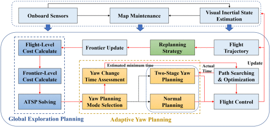
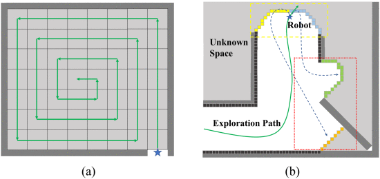

# **利用配备有限视场传感器的无人机快速绘制未知环境地图的自主探索方法**

---

[toc]

# 摘要

​	自主探索对于无人飞行器的各种智能操作至关重要，也极具挑战性。然而，由低质量轨迹或来回机动（BFM）导致的低效率问题依然存在。为了提高在未知环境中的探索效率，本文提出了一种快速自主探索规划器。我们首先设计了一种新颖的前沿探索序列生成方法，通过考虑非对称旅行推销员问题中的多层次因素，大大减少了探索过程中的 BFM。然后，根据探索序列和前沿分布情况，提出了一种自适应偏航规划方法，在探索过程中通过偏航变化覆盖更多前沿。此外，为了提高飞行的流畅性，还采用了动态重规划策略。所提方法的主要技术贡献是提供具有较少 BFM 的全面全局覆盖路径，并使用自适应偏航规划生成更合理的偏航轨迹。我们通过大量的对比和实际实验来验证我们方法的有效性和正确性。实验结果表明，在没有大量分散障碍物的平坦场景中，与典型方法和最先进方法相比，我们提出的方法具有更好的性能。

# 简介

​	智能机器人一直是众多领域追求的目标，在众多研究人员的努力下，已经出现了许多应用案例[1]。无人机作为一种数据采集和物资运输平台，以其独特的优势近年来被广泛应用于测绘[2]、环保[3]、救援[4]、军事[5]等领域。然而，在大多数作业场景中，它仍处于人工操作状态，自主操作能力仍显不足。作为无人机自主测绘能力的关键部分之一，自主探索已引起广泛关注，并涌现出许多优秀的自主探索算法 [6]、[7]、[8]、[9]。

## A. 现有问题

​	虽然现有的探索方法可以利用前沿或采样视点来探索环境，但仍有许多问题有待解决[6], [7], [10], [11], [12]。采样视点的方法可以轻松生成候选目标，但它们总是导致探索率和效率较低[6]。这些方法大多采用贪心策略，注重局部信息增益，但忽略了全局效率。Selin 等人 [10] 采用基于前沿的策略来指导 “下一个最佳视点 ”规划，从而提高了效率。然而，他们没有考虑无人机的动态特性，这将导致探索轨迹不平滑、低速飞行和大量的走走停停动作。虽然使用前沿的方法[7]、[11]可以通过搜索前沿和生成探索序列来快速探索整个环境，但寻找和描述前沿的过程总是计算成本高昂。FUEL [12] 是一种最先进的快速自主探索算法。其启发式框架可通过设计前沿信息结构（FIS）和分层规划实现无人机的快速高效探索。它能高频生成平滑、高速的探索轨迹。然而，尽管该算法与其他算法相比大大提高了探索速率和探索效率，但仍面临着探索过程中来回机动等影响探索效率的问题。

## B. 贡献

​	为了减少第 I-A 节中提到的来回机动导致的低效探索，本文基于 FUEL 框架，提出了一种新型快速自主探索规划器（FAEP）。为了提高探索轨迹的合理性和探索效率，我们设计了一种用于全局覆盖规划的综合探索序列生成方法，该方法不仅考虑了飞行层面的因素，还创新性地考虑了前沿层面的因素（前沿的空间特征），以减少在本文设计的各种仿真和典型复杂真实环境中的来回探索机动。根据空间特征，我们评估了前沿导致来回移动的潜在可能性，并根据可能性得到了更合理的探索序列。在确定局部探索目标后，设计了一种自适应偏航规划策略，以实现飞行过程中偏航变化的高效探索，该策略包含两种偏航规划模式：正常规划模式和两阶段规划模式。可根据前沿分布和自身运动状态选择合适的模式，以覆盖更多区域。此外，为了提高飞行的稳定性和速度，还采用了动态重规划。

​	我们在不同的仿真环境中将我们的方法与三种典型的先进方法进行了比较。实验结果表明，我们的方法比其他三种方法表现更优。与 “下一最佳视角 ”规划（NBVP）和自主探索规划（Aeplanner）这两种典型方法相比，我们的方法的探索过程快 3 到 7 倍。与最先进的方法 FUEL 相比，我们的方法减少了 20% 以上的飞行时间和飞行距离。此外，我们还通过机载真实环境探索验证了我们方法的有效性。本文的贡献概述如下：

1. 一种全面的前沿探索序列生成方法，该方法不仅创新性地考虑了飞行层面的因素，还考虑了前沿层面的因素，以减少来回机动；
2. 自适应偏航规划策略，通过两种偏航规划模式（正常规划模式和两阶段规划模式），在飞向本地目标时生成平滑的偏航轨迹，以覆盖更多的未知空间；
3. 在模拟中进行了充分的定量比较实验。此外，还进行了真实世界实验，以验证我们在各种环境下的方法。有关实验的更多详情，请参阅https://youtu.be/0Y671mEwJ_A 。

# 相关工作

近年来，许多学者对自主探索问题进行了研究，发表了大量多角度的方法，主要分为以下三类：基于采样的探索、基于前沿的探索和近年来出现的基于机器学习的算法。本文仅讨论前两类算法，它们已被广泛应用于各种探索任务中。

## A. 基于采样的探索方法

​	基于采样的探索方法使用自由空间中的随机采样视点，通过获取信息增益最大的路径来寻找下一个最佳视点 [13]。文献[6]设计了一种后退视界 NBVP，通过考虑整个路径上获得的信息来探索三维环境。NBVP 是第一种使用次佳视角概念进行后退视界探索的方法，许多方法都是从这种方法衍生出来的。这些方法在增量快速探索的随机树中选择信息增益最高的路径供无人机执行。文献[10]中的 Aeplanner 将前沿探索和 NBVP 结合在一起，避免了在没有探索所有区域的大型环境中卡住的情况，而且该方法还通过使用早期迭代的缓存点来加快估计潜在信息增益的过程。文献[14]使用增量采样和概率路线图来提高规划效率。方法[15]结合使用了基于采样和前沿的方法，以减少在大型场景中发现未开发区域的影响。还有一些两阶段方法[16]、[17]，通过在全局地图和局部地图采取不同的规划策略来有效覆盖整个环境。

## B. 基于前沿的探索方法

​	相比之下，基于前沿的方法主要包括两个过程：寻找前沿（已知区域和未知区域之间的边界）和解决访问前沿的全局路径序列问题。第一种基于前沿的探索方法由 Yamauchi [18] 提出，用于探索一般的二维环境，该方法选择最近的前沿作为下一个目标。随后，一种基于随机微分方程的探索算法[19]在三维环境中实现了探索。为了实现高速飞行，Cieslewski 等人[11]提出了一种在视场（FOV）中提取前沿并选择速度变化最小的前沿的方法。为了找到合理的前沿探索序列，[7] 采用了旅行商问题（TSP）。文献[20]通过采用信息驱动的探索策略选择了一个明智的探索目标。然而，许多方法都面临着全局覆盖效率低、飞行轨迹保守、决策频率低等问题。为解决这些问题，Zhou 等人[12]通过采用增量前沿结构和分层规划实现了快速探索。

# 建议方法

​	为了提高探索映射的效率，我们提出了一种 FAEP。我们的规划器的主要操作流程如图 1 所示。首先，我们根据无人机状态和传感器数据进行地图维护和前沿更新。其次，考虑飞行和前沿层面的因素，进行全局探索规划。第三，在全局规划结果的基础上，进行包含两种规划模式的路径规划和自适应偏航规划，以生成高质量的局部路径。最后，我们将规划结果提交给飞行控制执行，上述过程将根据重规划策略持续执行。

**图 1** 概述所提出的 FAEP。规划器的主要流程用红线表示。我们的主要贡献用深色（蓝色、黄色和绿色）表示。

## A. 前沿探索序列生成

​	前沿探索序列对于基于前沿的探索方法至关重要，其合理性直接影响到整个探索过程的效率。许多方法都使用 TSP 来获取探索序列。然而，大多数方法仅将前沿间的欧氏距离作为 TSP 的代价，这很简单但不够充分。虽然一些方法在欧几里得距离的基础上考虑了诸如偏航变化和速度方向等因素来提高探索序列的质量，但仍存在一些不足。与这些方法不同的是，首先，本文没有采用传统的 TSP，而是采用了更合理的非对称旅行商问题（ATSP）来求解。其次，本文不仅将飞行级因素（前沿与无人机之间的欧氏距离、偏航变化和速度方向变化）作为代价，还将前沿级因素作为代价函数的项，通过求解 ATSP 生成更好的全局探索序列。

​	根据完全覆盖路径规划问题的评价标准[21]，来回机动次数越少，效率越高。因此，当需要快速探索未知区域时，采用螺旋填充算法是最优策略之一[22]。如图 2（a）所示，螺旋算法在满足高覆盖率的同时，路径重叠较少。此外，为了防止不必要的来回操作，不应在已通过的地方留下小的未知区域。否则，如图 2(b)所示，会有很多区域造成机动。受此启发，本文认为，当前沿靠近探索区域的边界或独立的小区域时，相应的探索优先级应该更高。如果不优先探索该区域，就会造成来回机动，降低全局探索的效率。因此，与其他只考虑当前飞行等级因素的算法不同，该方法还考虑了前沿的空间特征，通过实现边界区域优先级更高、独立小区域优先级更高来获得更合理的前沿探索顺序，其中边界指任务确定的探索区域边缘。

**图 2** (a) 采用螺旋填充算法的勘探过程示意图。(b) 没有独立小区域优先权的探索过程。(b) 中的黄框表示正在探索的边界。(b) 中的红框表示将来会导致来回路径（虚线）的前沿。

为使边界地区获得更高的优先级，我们计算了 FIS 中每个边界
$$
F_{k}
$$
的边界成本
$$
c_{b}(k)
$$

$$
\begin{align*}
c_{b}(k)=&\left\lbrace\begin{array}{cl}
d_{\text{min} }(k),& D_{k}< r_{s} \\
d_{\text{min} }(k) \cdot \left(1+w_{d} \cdot \frac{D_{k}-r_{s}}{r_{s}}\right), & D_{k} \geq r_{s}\end{array} \right. \tag{1}\\
d_{\text{min} }(k) =& \text{min}\left(d_{x}^{k}, d_{y}^{k},d_{z}^{k}\right), \quad k \in \left\lbrace 1,2,\ldots, N_{\text{cls}}\right\rbrace \tag{2}
\end{align*}
$$

